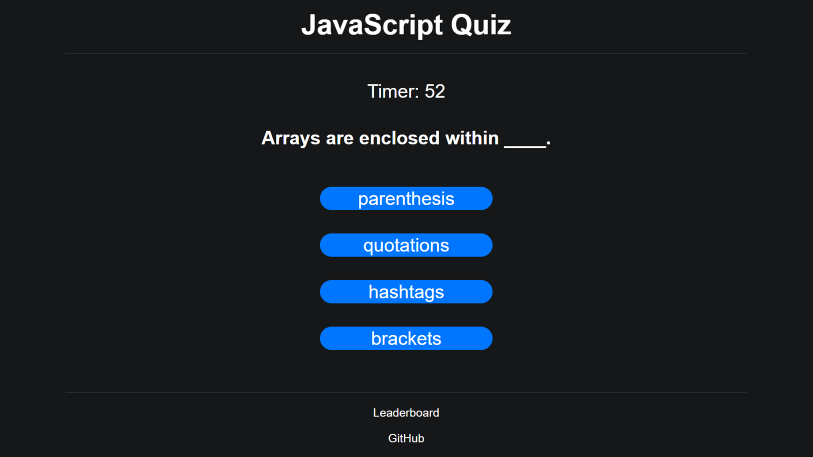

# Code-Quiz

## Description

- When the start button is clicked, the timer starts and a question is shown
- When a correct answer is selected, a new question is shown
- When an incorrect answer is selected, time is subtracted from the timer, and a new question is shown
- When all questions are answered or the timer reaches 0, the quiz ends
- When the quiz ends, the user can submit their name and score to a leaderboard
- When the user submits their name and score to the leaderboard, the data is also scored in local storage

## Link to site
https://joseph-s-foster.github.io/Coding-Quiz/

## Screenshot
